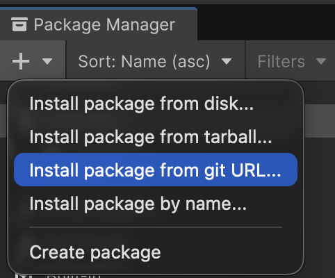
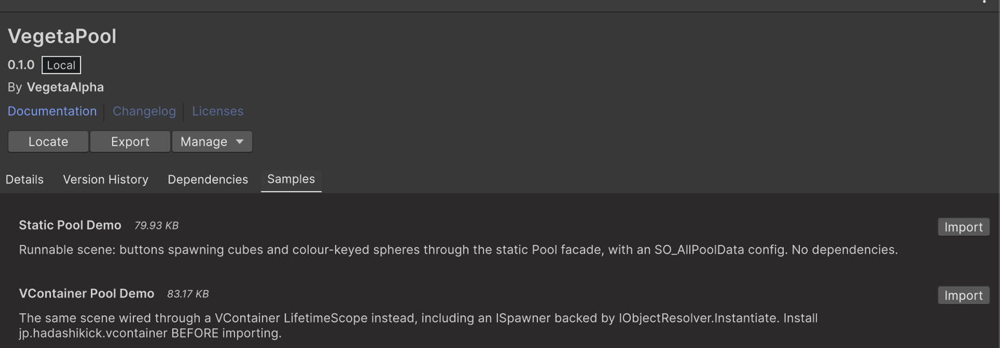
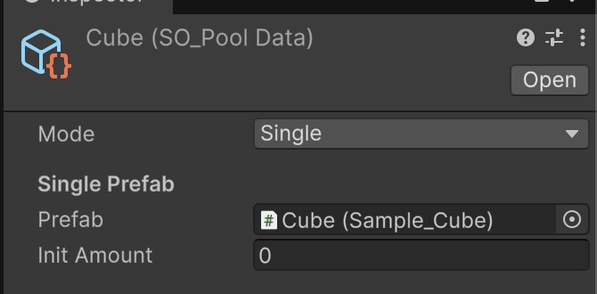
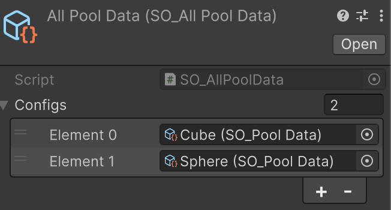

# VegetaPool

Object pooling for Unity. No dependencies.

## Installation

Package Manager → **+** → **Install package from git URL…**



```
https://github.com/VegetaAlpha/VegetaPool.git?path=Pool
```

Specific version — append `#<tag>`:

```
https://github.com/VegetaAlpha/VegetaPool.git?path=Pool#v1.0.0
```

Unity 2022.3+ · `?path=` must come before `#` · without a `#` the URL tracks `main`, so pin a tag
for anything you ship. See [Releases](https://github.com/VegetaAlpha/VegetaPool/releases).

### Importing the samples

Select **VegetaPool** in Package Manager → **Samples** tab → **Import**. Two demos appear:



**Install VContainer before importing the VContainer demo.** Its `.asmdef` references `VContainer`
by name, so importing it into a project that doesn't have the package leaves that reference
unresolved and the sample assembly fails to compile. Install it the same way — **+** → git URL:

```
https://github.com/hadashiA/VContainer.git?path=VContainer/Assets/VContainer
```

> Samples land in `Assets/Samples/VegetaPool/<version>/`. Open one demo scene at a time — running
> both in a single Play session trips the [mode guard](#the-two-modes-are-mutually-exclusive).

## One class, two ways to reach it

Everything lives on **`PoolSystem`**. `Pool` is a static facade that forwards every call to one
hidden `PoolSystem` instance.

```csharp
Pool.GetObj<Bullet>();      // static facade
pool.GetObj<Bullet>();      // your own instance
```

**The API is identical.** Sections 1–5 below are written as `pool.X` and apply to both — read them
as `Pool.X` if you use the static side. [Section 6](#6-static-vs-injected) covers setup and the
handful of things that actually differ.

---

## 1. Make something poolable

```csharp
using UnityEngine;
using VegetaSystem;

public class Bullet : MonoBehaviour, IPoolable
{
    public void OnGet()     => gameObject.SetActive(true);
    public void OnRelease() => gameObject.SetActive(false);
}
```

> **Released objects are parked, not destroyed** — every field still holds what it held. In
> `OnRelease`, null your references, clear your collections, and unsubscribe from events: an
> inactive object receives no `Update`, but it still receives C# events.

### Variants — `ISubKeyPoolable`

One class, several interchangeable prefabs, each its own pool. The whole mechanism is one method:

```csharp
string GetSubKeyPool();
```

It returns a plain `string` and the pool never looks at where it came from — a serialized field, a
constant, `gameObject.name`, an id from your own data all work.

**An enum is the recommended source.** The same key has to appear on the prefab and at the call
site; typing it by hand on either side is a silent failure waiting to happen.

```csharp
public class Sphere : MonoBehaviour, ISubKeyPoolable
{
    [SerializeField] private SphereType sphereType;   // set per prefab

    public string GetSubKeyPool() => sphereType.ToString();

    public void OnGet()     => gameObject.SetActive(true);
    public void OnRelease() => gameObject.SetActive(false);
}
```

```csharp
pool.Register(redSpherePrefab, 10);                        // key comes from the prefab
var red = pool.GetObj<Sphere>(SphereType.Red.ToString());  // same source, so it can't drift
```

> - **Matching is exact and case-sensitive** — `"Red"` registered, `"red"` requested gets a
>   `Pool config not found` warning and a `null`. That is what the enum buys you.
> - **The key is read off the prefab during `Register()`**, so fix it per prefab; don't compute it
>   from runtime state.

---

## 2. The API

| | |
|---|---|
| `Register<T>(prefab, initAmount)` | Records config only. The `initAmount` instances are prewarmed on the first `GetObj<T>()`, never here |
| `GetObj<T>()` | `IPoolable` |
| `GetObj<T>(subKey)` | `ISubKeyPoolable` |
| `ReleaseObj(obj, ignoreParentPool = false, worldPosStay = true)` | Back to the pool |
| `DestroyPool<T>()` | One type, every subKey |
| `DestroyPool<T>(subKey)` | One variant |
| `DestroyAllPools()` | Everything |

```csharp
pool.Register(bulletPrefab, initAmount: 20);
pool.Register(redSpherePrefab, 10);              // subKey comes from GetSubKeyPool()

var bullet = pool.GetObj<Bullet>();
var red    = pool.GetObj<Sphere>(SphereType.Red.ToString());

pool.ReleaseObj(bullet);
pool.DestroyPool<Bullet>();
```

> - `GetObj` **returns `null`, it does not throw**, when nothing is registered. It logs
>   `Pool config not found: <Type>/<subKey>` first.
> - `ignoreParentPool: true` leaves a released object where it is in the hierarchy instead of
>   re-parenting it under the pool container.
> - `Register` keys by `prefab.GetType().Name` — the **runtime** type, not the compile-time `T`.
> - **`DestroyPool` does not unregister.** `Register` only stores config — the prefab and the
>   amount — never a pool or an object. Destroying frees the pool and everything in it but leaves
>   that config, so the next `GetObj<T>()` rebuilds the pool and prewarms `initAmount` again. You
>   never re-register.

### Release — two ways

```csharp
pool.ReleaseObj(bullet);      // from a spawner or controller
```

```csharp
this.Release();               // from inside the object, no pool reference needed
bullet.Release();             // same extension, from outside
```

| | `pool.ReleaseObj(obj)` | `this.Release()` |
|---|---|---|
| Needs a pool reference | yes | no |
| Cost | dictionary lookup | one `GetComponent` |
| Use for | spawners, controllers | self-expiring objects, effects, projectiles |

`Release()` works in both modes: each instance carries an internal tracker recording which
`PoolSystem` spawned it, so it routes correctly even with several pools alive.

> Releasing twice is safe. Releasing something that never came from a pool logs a warning and does
> nothing.

---

## 3. Supplying prefabs

`Register()` takes a `Component` — **where it came from is your business.** ScriptableObject,
Addressables, `Resources.Load`, a factory, a plain field: all fine. Only the first is built in.

### `SO_AllPoolData` — built in

Create → **Pool → PoolData** per entry, then Create → **Pool → AllPoolData** collecting them. Each
entry is `Single` (one `IPoolable`) or `Multiple` (a list of `ISubKeyPoolable` variants) — the
Inspector only draws the fields for the mode you pick.

| `SO_PoolData` — one entry | `SO_AllPoolData` — collects them |
|---|---|
|  |  |

```csharp
[SerializeField] private SO_AllPoolData poolConfig;

poolConfig.ApplyTo(pool);     // walks the list calling Register()
```

### Everything else — you write it

Addressables, for example:

```csharp
public static class AddressablePoolLoader
{
    public static async Task RegisterAsync<T>(
        this PoolSystem pool, string key, int initAmount) where T : Component
    {
        var handle = Addressables.LoadAssetAsync<GameObject>(key);
        var prefab = await handle.Task;
        pool.Register(prefab.GetComponent<T>(), initAmount);
    }
}
```

```csharp
await pool.RegisterAsync<Bullet>("bullet_basic", 20);
var bullet = pool.GetObj<Bullet>();
```

> - **Await before the first `GetObj`.** Registration is async, `GetObj` is not.
> - **Don't release the handle while you still use that type.** `Register()` keeps the prefab and
>   instantiates from it every time the pool grows, and `DestroyPool` doesn't drop that config.
>   Once the asset is unloaded the prefab reference is dead, so the next `GetObj` that has to
>   create an instance throws `ArgumentException: The Object you want to instantiate is null.` —
>   objects already spawned keep working, which is what makes this show up late. After releasing,
>   either stop using that type or `Register()` it again with a freshly loaded prefab.
> - **Don't put Addressable prefabs in `SO_PoolData`.** Its `Prefab` field is a direct reference,
>   so the asset gets pulled into the build as a hard dependency — defeating Addressables.

---

## 4. Spawner — how instances get created

```csharp
public interface ISpawner
{
    T Spawn<T>(T prefab) where T : Component;
}
```

Default is `DefaultSpawner` (plain `Object.Instantiate`). The main reason to replace it is DI —
`Object.Instantiate` does not resolve `[Inject]` members, so a pooled prefab with dependencies comes
out half-initialised:

```csharp
public class VContainerSpawner : ISpawner
{
    private readonly IObjectResolver resolver;

    [Inject]
    public VContainerSpawner(IObjectResolver resolver) => this.resolver = resolver;

    public T Spawn<T>(T prefab) where T : Component => resolver.Instantiate(prefab);
}
```

> **`Spawn` only runs when the pool creates a new instance** (prewarm, or `GetObj` on an empty
> pool). Reuse never touches it, so this is off the hot path.

How you install a spawner is one of the few things that differ between modes — see
[section 6](#6-static-vs-injected).

---

## 5. Lifetime — you own it

**The pool never shrinks and never cleans itself up.** That is deliberate: destroying pooled
objects is your decision, not a side effect of a scene unloading.

| Event | What the pool does |
|---|---|
| `Register(prefab, 20)` | Nothing yet — lazy |
| First `GetObj<T>()` | Container created, 20 prewarmed |
| `GetObj<T>()` on an empty pool | **Creates one more.** The pool grows |
| `ReleaseObj(obj)` | Deactivated and parked. **Still in memory** |
| Scene unload | **Nothing** — the pool root is `DontDestroyOnLoad` |
| DI scope disposed | **Nothing** — `PoolSystem` is not `IDisposable` |

```csharp
pool.DestroyPool<Bullet>();          // one type, every subKey
pool.DestroyPool<Sphere>("Red");     // one variant
pool.DestroyAllPools();              // everything
```

- **`DestroyPool<T>()`** when a feature is done with a type — leaving a level, closing a mode.
- **`DestroyAllPools()`** when switching major sections, or at teardown.
- **Nothing at all** for genuinely global objects — UI popups, hit effects, damage numbers.

> - **Release is not destroy.** `ReleaseObj` parks an object for reuse; only `DestroyPool` /
>   `DestroyAllPools` gives the memory back.
> - **The pool grows to your peak concurrent usage and stays there.** 300 projectiles in one boss
>   fight means 300 instances alive in the main menu three scenes later.
> - **`DestroyPool` also destroys checked-out instances**, including ones you re-parented
>   elsewhere.

---

## 6. Static vs injected

### Setup

**Static** — nothing to install, nothing in the scene:

```csharp
Pool.Register(bulletPrefab, 20);
var bullet = Pool.GetObj<Bullet>();
```

**Injected** — register once as a singleton in your root scope:

```csharp
builder.Register<ISpawner, VContainerSpawner>(Lifetime.Singleton);
builder.Register<PoolSystem>(Lifetime.Singleton).AsSelf();
```

```csharp
private PoolSystem pool;

[Inject] public void Construct(PoolSystem pool) => this.pool = pool;
```

Or with no container at all: `var pool = new PoolSystem();`

### What actually differs

Everything in sections 1–5 is identical. Only these are not:

| | Static | Injected |
|---|---|---|
| Install a spawner | `Pool.Spawner = new MySpawner();`<br>**set-once** — before the first `Register`/`GetObj`, or the setter throws | `new PoolSystem(new MySpawner())`, or register `ISpawner` in the container |
| How many pools | exactly one, forever | as many as you like — but **prefer one**, see below |
| Reach the `PoolSystem` | `Pool.GetPoolSystem()` | you already hold it |
| Cleanup | call `Pool.DestroyAllPools()` wherever you decide | same, but see below |

`Pool.GetPoolSystem()` is a method rather than a property on purpose: the first call creates the
singleton, locks in static mode and can throw — none of which should fire because a debugger
evaluated a property on hover.

### Prefer a single pool

Nothing in this package frees a pool for you — that is your call, by design. So every extra
`PoolSystem` is one more thing you have to remember to destroy, and each owns its own
`DontDestroyOnLoad` root that outlives the scope that created it.

**Register it once as a singleton in the root scope** (`Lifetime.Singleton` above, or whatever your
container calls it) and you have exactly one pool to reason about — the same shape the static mode
gives you, minus the global.

Reach for a second instance only when you actually want a separate lifetime: a pool you intend to
destroy along with its scope. Then teardown is on you, and skipping it strands an unreachable root
every time the scope is recreated:

```csharp
protected override void OnDestroy()
{
    // Resolve before base.OnDestroy(), which disposes the container.
    if (Container != null && Container.TryResolve<PoolSystem>(out var pool))
        pool.DestroyAllPools();

    base.OnDestroy();
}
```

### The two modes are mutually exclusive

```csharp
Pool.GetObj<Bullet>();     // static mode claimed
new PoolSystem();          // InvalidOperationException
```

Using both would silently give you two disconnected pools, so it throws instead. Several
*injected* pools are fine — only mixing the two **modes** throws.

> The claim resets on domain reload. If you turn off **Reload Domain** in *Enter Play Mode
> Options*, it survives between Play sessions and your second run throws.

---

## 7. Samples

Two runnable demo scenes, the same demo built both ways — see
[Importing the samples](#importing-the-samples) for how to get them.

| Sample | Needs | Shows |
|---|---|---|
| **Static Pool Demo** | nothing | Buttons spawning cubes and colour-keyed spheres through `Pool.*`, configured by an `SO_AllPoolData` asset |
| **VContainer Pool Demo** | VContainer | The same scene through a `LifetimeScope`, plus an `ISpawner` backed by `IObjectResolver.Instantiate` |

The two controllers are identical apart from `Pool.` versus `pool.`.

---

[VegetaAlpha](https://github.com/VegetaAlpha) · `com.vegetaalpha.pool` · part of
[VegetaSystem](https://github.com/VegetaAlpha/VegetaSystem)
